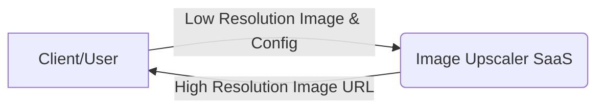
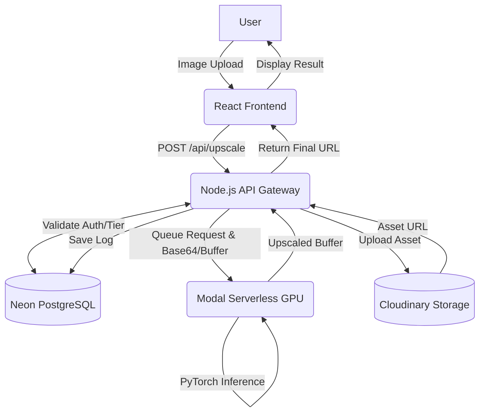
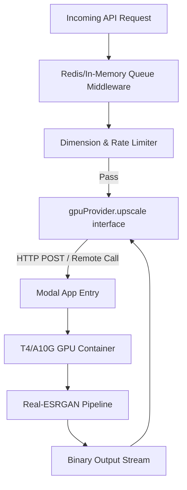

# 5. DFD Diagram

## 5.1 Level 0 Data Flow Diagram
The Context Diagram (Level 0) illustrates the holistic interaction between the external entities (User) and the core Image Upscaler System.

## 5.2 Level 1 Data Flow Diagram
The Level 1 DFD decomposes the monolithic system into distinct primary subsystems, elucidating the routing of image payloads and metadata.

## 5.3 Level 2 Data Flow Diagram (Processing Subsystem)
The Level 2 DFD specifically targets the complex inference pipeline managed asynchronously between the Node.js API and Modal's Python worker.

