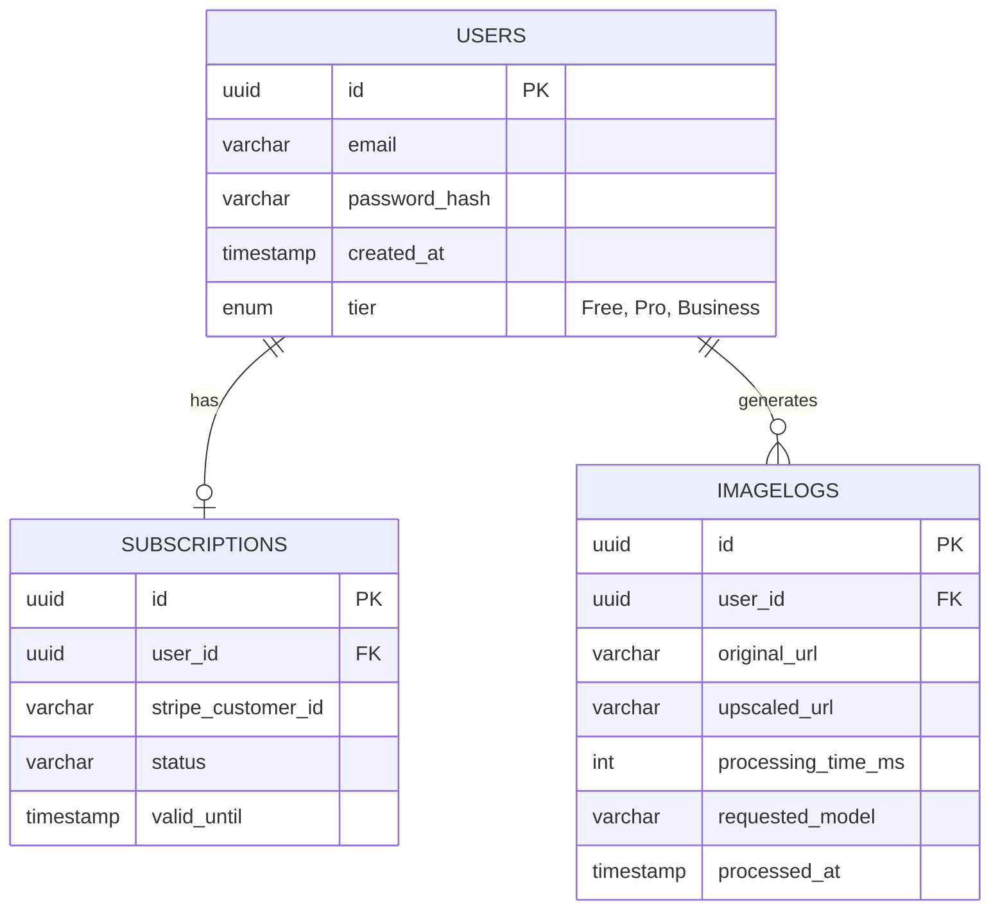

# 6. Entity Relationship Diagram

The database structure adheres to relational normalization principles optimized for Neon PostgreSQL. The primary entities include Users, Subscriptions, and ImageLogs interactions capturing billing, security, and payload lifecycle metrics.

